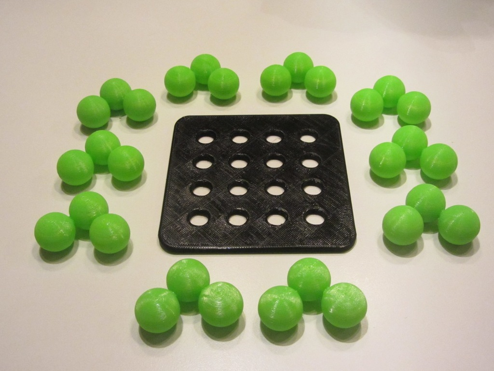
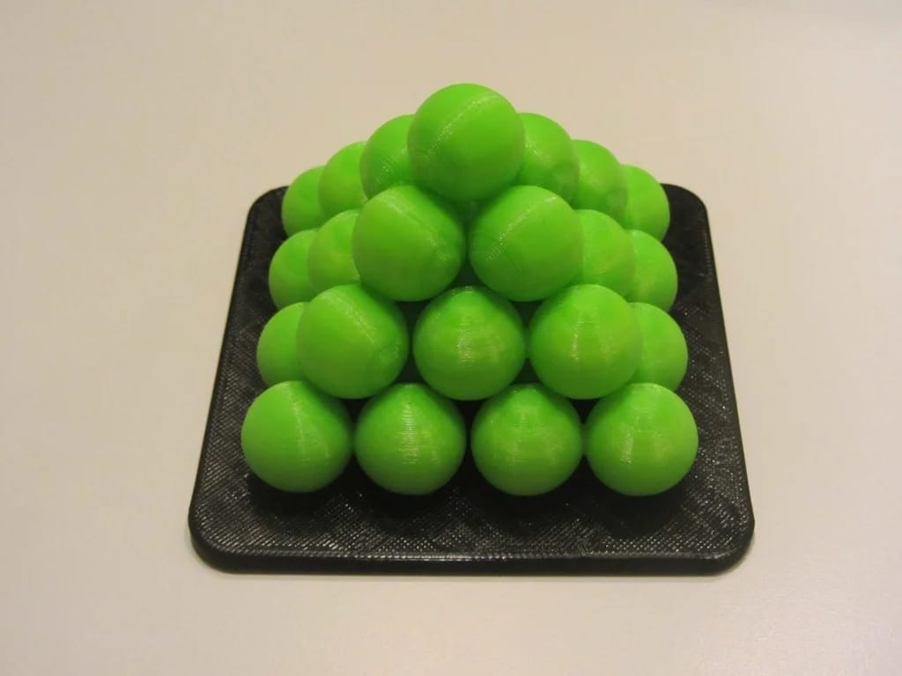
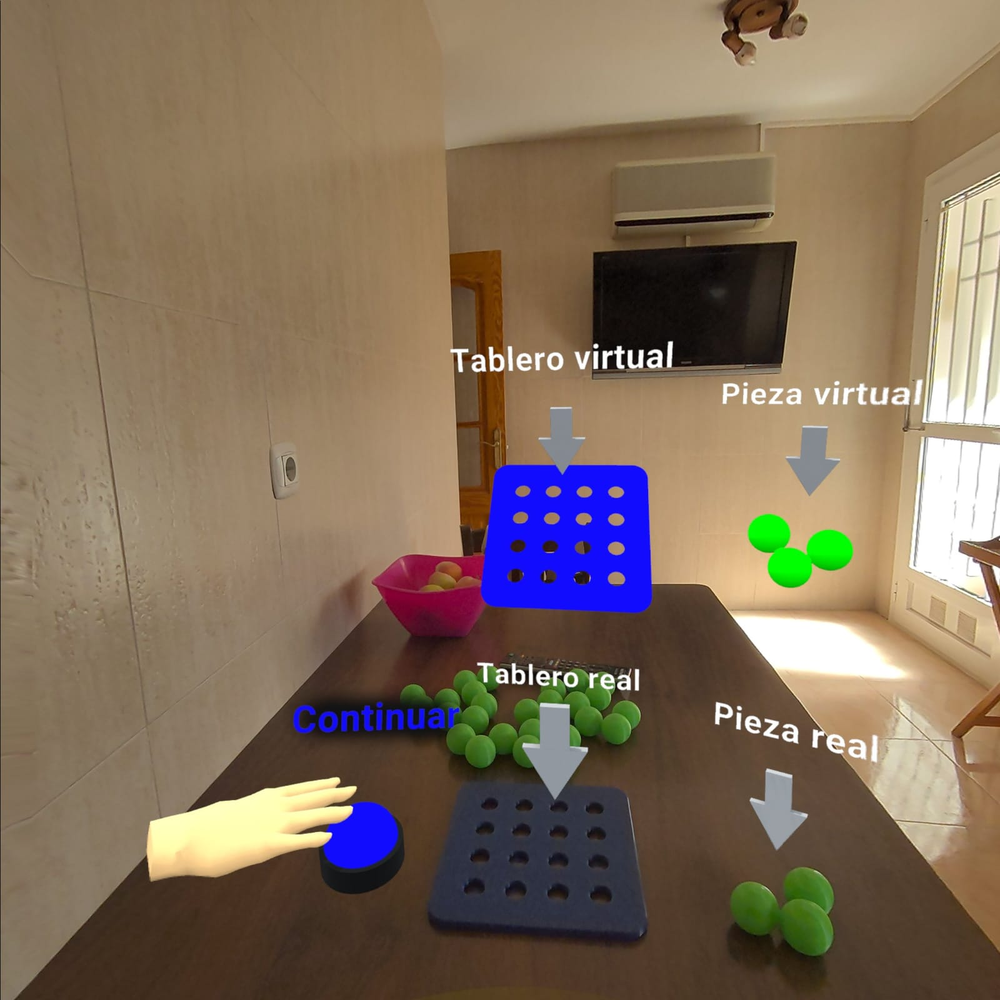
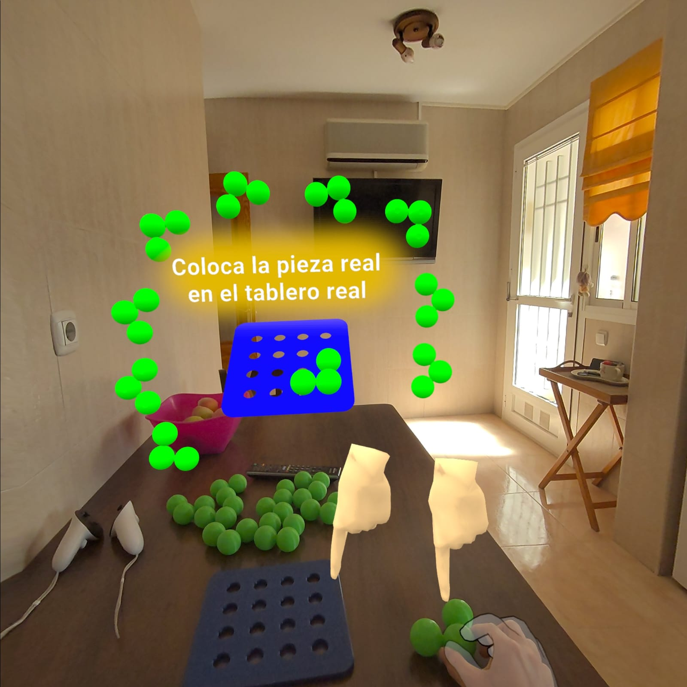
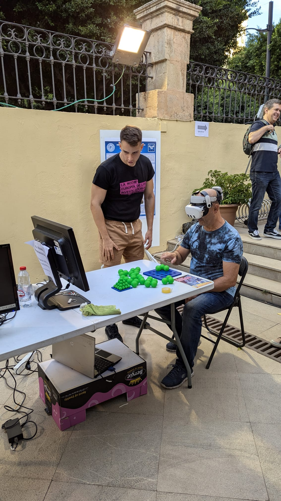
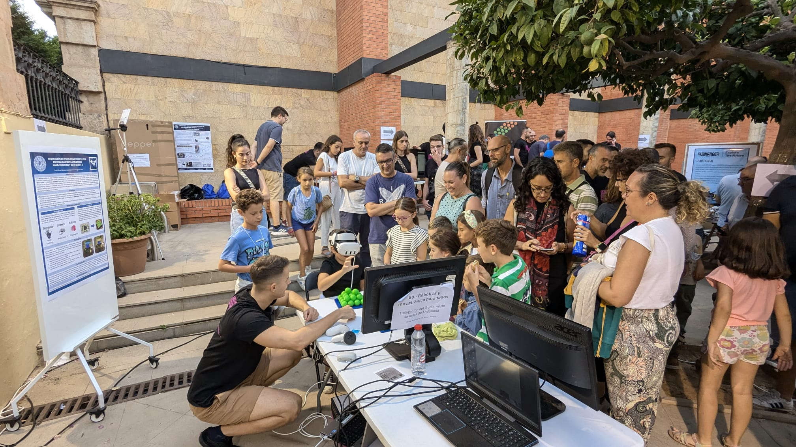

# Noche Europea de los Investigadores - Proyecto de Realidad Mixta para resolución de problemas complejos

## Descripción
Este proyecto presenta una **experiencia inmersiva de resolución de problemas** desarrollada para la Noche Europea de los Investigadores, utilizando tecnologías de **Realidad Mixta** con el dispositivo **Meta Quest 3**.

**Autor:** Daniel Bervel Morales  
**Fecha:** 27-09-2024  
**Formación:** Ingeniero electrónico industrial y automática | Máster en Industria 4.0

## Introducción
En el marco de la **Noche Europea de los Investigadores**, desarrollé una experiencia donde los participantes intentaban resolver un rompecabezas en un entorno **híbrido** que combinaba piezas físicas y virtuales. La experiencia comenzó con un desafío tradicional, y aquellos que no lo resolvían en el primer intento podían utilizar **Realidad Mixta** para obtener una solución guiada en tiempo real, interactuando con el puzzle a través del **seguimiento de manos**.

Este enfoque permite a los usuarios comprender mejor la **estrategia y la resolución espacial de problemas** mediante el uso de herramientas tecnológicas avanzadas. Además, se analizó cómo la RM puede ser una herramienta clave en **contextos educativos** e industriales, abriendo nuevas oportunidades para el aprendizaje interactivo.

## Componentes del Proyecto

1. **Rompecabezas Físico Inicial**: Los usuarios comenzaron resolviendo un rompecabezas físico bajo presión de tiempo (3 minutos), fomentando la toma rápida de decisiones.
   
   

2. **Solución Guiada en Realidad Mixta**: Los usuarios que no completaron el puzzle en el primer intento pasaron a una **experiencia en Realidad Mixta**, donde podían interactuar simultáneamente con objetos físicos y digitales para completar el puzzle de manera guiada y utilizando el seguimiento de manos.

   
   

3. **Análisis de Comportamiento en Tiempo Real**: A lo largo de la presentación, se registraron las diferencias entre el rendimiento sin tecnología y con realidad mixta, lo que permitió evaluar cómo la **tecnología inmersiva** afecta la **comprensión espacial** y la **estrategia de resolución**. Fue fascinante ver cómo incluso los más pequeños completaban la experiencia con facilidad, demostrando lo accesible y potente que puede ser la tecnología inmersiva para el aprendizaje y la educación. 

## Conclusiones
Esta experiencia no solo fue interactiva y entretenida, sino que demostró el potencial de la **Realidad Mixta** para mejorar la educación y la formación, adaptándose a todas las edades y capacidades. Incluso **niños de 5 años** lograron completar el puzzle con facilidad, resaltando lo accesible que puede ser esta tecnología. La combinación de **Realidad Mixta** y resolución de problemas permite un enfoque más **práctico e intuitivo** para el aprendizaje, aplicable en diversos campos educativos e industriales. Este proyecto no solo destaca la **innovación tecnológica**, sino también cómo la realidad mixta puede ser una herramienta clave para **mejorar la enseñanza** y las **habilidades prácticas** en un entorno interactivo.

Si te interesa ver cómo fue la experiencia en vivo, aquí te dejo un vídeo resumen:

